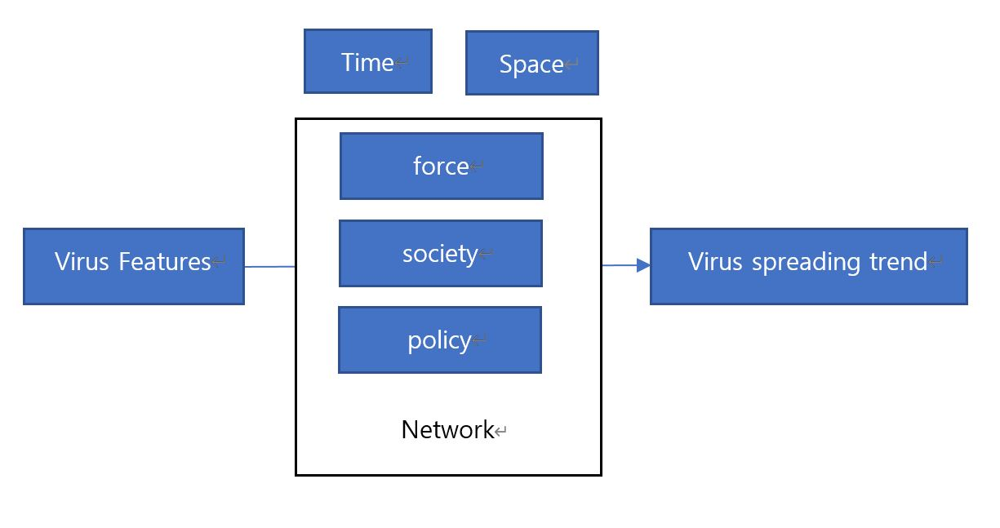
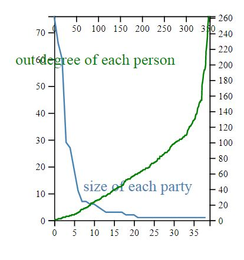
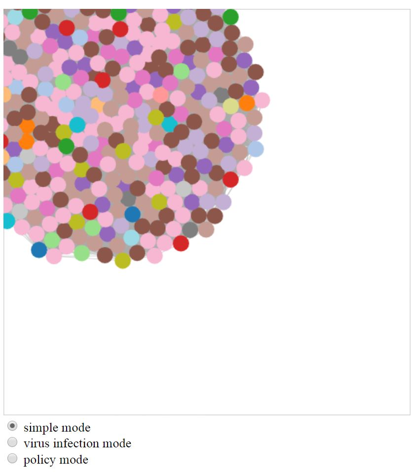

###### NARA_Living_Lab's CSR project

## Force Atlas & Virus Simulation 

### Motivation

A much of flooding news regarding COVI-19 virus spreading sparked me to ask the very naïve research question: When will this nightmare  be ended, and have we handled well so far ? As a data scientist mainly working for government-funded research projects, I’ve insisted an  importance of open source project, living-lab movement, and data-driven policy. However, facing a wholly new panic called corona virus, I must confess that I’ve been neglected in exploring real-world questions and spent much of time in submitting and revising old-fashioned-nobody-care manuscripts.

본 연구는 연일 계속되는 COVI-19 뉴스를 접하면서, “도대체 이 악몽은 언제 끝나고, 우리가 제대로 대처를 잘하고 있는 것인지?” 라는 “현실적인” 질문에서 시작되었습니다. 정부를 향해서는 정책은 데이터 기반으로 결정되어야 한다고 주장했었고, 데이터 과학자로서는 학문과 일상의 문제가 융합될 수 있는 연구를 하겠다고 Living Lab을 시작했지만, 제가 정작 그러한 “현실적”인 문제에 대한 탐구는 외면해왔었다는 무거운 반성이 본 연구의 배경이라 하겠습니다. 

### Related Work

This work is especially owe to several seminal work of a novelist (Isaac Asimov) from his book Foundation (https://en.wikipedia.org/wiki/Foundation_series), and an artist (Daniel Shiffman) from his book of Nature of code  (https://natureofcode.com/), a scientist (Anthony Giddens) from his theory of Structuration(https://en.wikipedia.org/wiki/Structuration_theory) and much of efforts of software developers in open source society (https://github.com/d3/d3-force).  There have been extant work on virus simulation in Academy. One of notable works is Thomas Woolley’s project on diffusion or dead (https://www.cardiff.ac.uk/news/view/825352-diffusion-of-the-dead-using-mathematics-to-escape-a-zombie-apocalypse) which especially inspired for me to teach University students about the random-walk and Monte Carlo simulation in java-script with aid of Kahn Academy. Author wish this work would contribute to much of extant wisdom of various discipline above mentioned.  

네, 저의 워너비인  Asimov 의 소설 파운데이션의 플롯, 뉴욕대의 아티스트 Shiffman 의 물리학 (인력과 척력) 시뮬레이션 알고리즘, 사회학자 안토니 기돈의 구조화 이론을 맘껏 썼습니다. 라이브러리는 물리법칙을 구현하기에 최적의 함수를 제공하는 D3-force 활용했습니다. 
물론, 바이러스 확산 모델링에 대한 다양한 선행 연구가 있어왔다는 것을 간단히 언급해야 할 것 같습니다. 1월에 발표된 연구에서는 (https://www.mobs-lab.org/uploads/6/7/8/7/6787877/wuhan_novel_coronavirus__6_.pdf) 이미 서울을 우한 바이러스에 2번째로 취약한 도시로 예측하기도 하였습니다.  이런 종류의 우울한 모델링은 주로 수학자들의 몫인데 그 중에서도 주목할 만한 프로젝트는 Woolley의 좀비 확산 시뮬레이션 프로젝트 (https://www.cardiff.ac.uk/news/view/825352-diffusion-of-the-dead-using-mathematics-to-escape-a-zombie-apocalypse) 로서, Dr. Woolley 가 그의 동지들과 함께 자발적으로 시작했던 비극적이기 보다는 위트 가득한 프로젝트입니다. 
저자(개발자)는 본 연구가 이 세상에 존재하는 지혜와 상상력 더해서 현실 문제 해결의 단초를 조금이나마 제공할 수 있는 시도로서 기여할 수 있기를 감히 기대합니다. 

### Model

This study investigates how the trend of virus spread will be affected by force, society and policy within network under the view of time and space as follows: 

본 연구는 어떻게 바이러스의 확산이 사회 관계망에 존재하는 힘, 사회, 정책에 따라서 변화되는가를 시간과 공간 관점에서 밝히는 것입니다.

In this model, people’s movements are viewed as positions of nodes of world network. Their positions are initially determined by law of nature (force) and social scheme (society). As for force, I assume every nodes of network interacts with each other with attraction or repulsion like the way force does in the nature. As for society, I assume nodes belong to a certain party such as nation or political party, but furthermore, nodes interact with each other who belong to different parties. People with same party are possibility positioned close. As for policy, I incorporate the governmental action as isolating (blocking) some of people. 
Turning to virus movement, it is featured by statistics with known numbers - cure rate, host-killing rate, and with unknown numbers - spreading rate in terms of the social links or spatial position.
Both of people’s movement and virus spreading, both time and space have unique and important roles in that virus move to spatially-closely positioned host (person) and move to timely-next target (person). 

사람들의 이동은, 네트워크의 노드들의 위치의 변화로 모델링되었습니다. 노드들의 위치는 자연 법칙인 ‘힘’ 과 사회적 시스템인 ‘사회’에 따라 결정됩니다.  ‘힘’ 차원에 대해서는, 각 노드들이 서로 (중력처럼) 인력과 척력을 가진 존재들로 모델링되었습니다. 물리학을 이용한 모델링은 정보물리학 특히 지리학 분야에서 광범위하게 사용되는 방법입니다. 사람의 이동에 대한 모델링은 중력을 사용하여 정의하고 중력 상수를 추정하는 방식을 사용합니다.  ‘사회’ 차원은 사회관계망을 활용하여 모델링하였습니다. 먼저 각 노드는 특정한 집단에 (여기서는 party) 소속됩니다. 각 노드는 자신이 속하는 집단에 상관없이 다른 노드와 연결되어 있습니다. 본 연구에서는 특히 방향성 네트워크만을 가정하였습니다. 즉, Source는 Target에 영향을 주지만 Target 은 Source에 영향을 미치지 않습니다. 마지막으로 “정책” 차원은 정부의 개입을 모델링한 차원인데, 여기서는 특정 노드를 다른 노드들과 격리시키는 행위를 적용하였습니다.바이러스 확산은, 통계수치로 정의됩니다. 알려진 정보인 치료율, host-killing 비율, 그리고 알려지지 않은 정보인 사회관계망을 통한 확산 및 인접하는 공간에서사람들의 이동은, 네트워크의 노드들의 위치의 변화로 모델링되었습니다. 노드들의 위치는 자연 법칙인 ‘힘’ 과 사회적 시스템인 ‘사회’에 따라 결정됩니다.  ‘힘’ 차원에 대해서는, 각 노드들이 서로 (중력처럼) 인력과 척력을 가진 존재들로 모델링되었습니다. 물리학을 이용한 모델링은 정보물리학 특히 지리학 분야에서 광범위하게 사용되는 방법입니다. 사람의 이동에 대한 모델링은 중력을 사용하여 정의하고 중력 상수를 추정하는 방식을 사용합니다.  ‘사회’ 차원은 사회관계망을 활용하여 모델링하였습니다. 먼저 각 노드는 특정한 집단에 (여기서는 party) 소속됩니다. 각 노드는 자신이 속하는 집단에 상관없이 다른 노드와 연결되어 있습니다. 본 연구에서는 특히 방향성 네트워크만을 가정하였습니다. 즉, Source는 Target에 영향을 주지만 Target 은 Source에 영향을 미치지 않습니다. 마지막으로 “정책” 차원은 정부의 개입을 모델링한 차원인데, 여기서는 특정 노드를 다른 노드들과 격리시키는 행위를 적용하였습니다.의 확산 비율이 포함됩니다. 
위에서 소개한 사람의 이동과 바이러스의 확산에 있어서 시간과 공간에 중요한 역할이 있는데, 예를 들어 바이러스는 공간적으로 인접한 노드를 통해서 확산이 됩니다. 하지만, 바이러스는 하나의 숙주를 감염시키고 시간적으로 다음의 숙주로 이동하기 때문입니다.  

### Method

#### Dataset 
Json -typed dataset was used as following example of network with two nodes and two parties: 
[graph: [nodes: {name: AAA, party: aaa}, {name: BBB, party: bbb}], [links: {source: AAA, target: BBB}]]

I used the dataset of d3 https://github.com/d3/d3-force because of two reasons, first, thankfully, it is open and second it explains plausibly real-world pattern of social connection in that it represents the distribution of parties is scale-free but the connection of each nodes is not. 

D3 커뮤니티에서 제공하는 스페인 정당 사회관계망 데이터를 사용하였습니다.
아래 차트의 왼쪽, 아래쪽 눈금은 각 정당 사이즈입니다. 최대 37개의 정당이 있으며, 최대 약 70명의 멤버를 보유합니다. 전체 약 350명의 노드가 있으며 이들은 최대 260명의 멤버와 연결되어 있습니다. 

#### Simulation parameters
##### Force atlas
The force simulation requires five parameters: i) link attraction ii) party force iii) horizontal force iv) collision, and v) charge of all people. The link attraction affects the linked nodes to positioned closely, party force affects the member of same parties to positioned closely. The horizontal force applies to pull all the nodes to centered horizontal lines just like gravity does. Collision force detects other nodes within given radius (neighbor) and repulse against it preventing collision. The parameter for collision force sets the radius for such repulsion. The charge of all people affects mutually almost all the nodes, it makes one node attracts or repulses each other.
Above mentioned five forces are summed to decide the optimum position for each node. 

시뮬레이션 파라메터는 위치를 정의하는 힘 (Force) 과 확산을 정의하는 Virus 파라메터로 구성됩니다.
힘과 관련된 파라메터는 총 5개입니다 i) 링크 간의 인력, ii) 집단이 가지는 인력 iii) 수평선 인력 iv) 충돌 회피 (사회적 거리두기) v) 모든 사람들 (모든 구성원의 응집정도) 입니다.  링크간의 인력은 링크로 연결된 각 노드들 간에 작용하는 인력입니다. 연결된 노드의 차수가 높은 경우, 더 강한 인력을 가집니다. 각 집단은 (무형이기는 하지만) 원점으로부터 일정 위치에 떨어진 고유의 지점에서의 인력을 보유합니다. 만약 집단의 인력이 없다면, 노드는 동일 집단에 속하는 다른 노드와 인접하지 않습니다. 수평선 인력은 중앙에 위치한 수평선으로부터의 인력이며, 노드들의 위치를 수평적으로 안정되게 조정하는 역할을 합니다. 충돌 회피 척력 주어진 반지름 이내에 위치하는 노드들과의 척력입니다. 여기에서 파라메터는 충돌로 인지하는 반지름을 결정합니다. 반지름의 크기가 정해지면 노드들은 그 이하로는 인접하지 않습니다.  마지막 힘은 각 노드와 다른 모든 노드들간에 적용되는 인력 또는 척력을 의미합니다. 인력 수치가 높은 경우, 모든 노드는 서로 뭉치려는 경향이, 척력 수치가 높은 경우, 흩어지려는 경향이 발생합니다.

##### Virus Spread
The virus simulation requires four parameters: i) spread rate of social tie (from socially connected) ii) spread rate of neighbor (from spatially closed) iii) disappear rate, and iv) host-killing. The spread rate of social ties affects the linked people from source to target only. I do not incorporate the node within same party without direct link, however, force party makes those nodes positioned close, thus they have change to occasionally meet as a neighbor.  

바이러스 확산 시뮬레이션은 4개 파라메터로 구성됩니다. 알려진 정보인 치료율, host-killing 비율, 그리고 알려지지 않은 정보인 사회관계망을 통한 확산 및 인접하는 공간에서의 확산 비율이 포함됩니다. 

#### Random Walk simulation mode along with User interruption mode 
Once above-explained parameters were set, user selection for initial seeds of virus are required. After then, virus starts to spread according to the given rate and calculated positions of nodes. I use random walk simulation approach thus every chance of spreading, disappearing, and host-killing is calculated by the random number at each time point. I only incorporate link and space features of nodes but not other conditions about nodes – such as age. 
The third element of network in reference mode, namely, policy is not applied in random simulation mode but applied by the user-interruption. User choose the nodes which, he/she thinks, should be blocked to prevent spread of virus then move to random simulation node. Once choose as isolated node, nodes positioned far from other nodes and but not unlink the social ties.

앞에서 설명한 파라메터들이 결정되면, 적극적인 사용자 참여와 컴퓨터 시뮬레이션이 결합된 방식의 랜덤 워크 확산이 시작됩니다! 이 부분이 본 연구에서 특히 중요한 부분입니다. 한 번의 세팅으로 결과를 예측하는 것이 아니고 확산의 중간에 발생하는 다양한 이벤트와 시나리오를 적용한 결과를 예측하는 것이기 때문이죠. 기본적인 컴퓨터 시뮬레이션은 랜덤 상수를 발생시켜 앞서 파라메터와 비교하는 랜덤 워크 방식을 사용합니다. 
좀더 구체적으로 설명하면 사용자가 초기에 감염자를 선택하고, 이렇게 시드가 선택되면, 이후에는 랜덤 워크 방식으로 바이러스 확산이 시작되며, 사용자의 클릭으로 해당 시점별 각 노드의 전염, 치료, host-killing 이 결정됩니다. 참조 모델의 “정책” 은 다시 사용자 참여가 요구되는 영역인데, 이 모드로 전환되면 사용자의 참여에 의해 격리시킬 노드가 선택됩니다. 다시 바이러스 확산 모드로 전환되면 랜덤 확산 시뮬레이션이 시작됩니다. 

### Applicaion

The simulation program consists of 4 panels: i) story panel, ii) left sided parameter mix panel iii) main network panel, and iv) statistics & chart. In story panel, it presents the basic statistics of dataset, force and virus parameters, and selected people to be isolated. In left sided panel, user choose parameters regarding force and virus features. In main network panel, user views the networks of given force. Each party presents different colors. If people affected virus, it colors in gray. If people killed, in black, if recovered shaped in rectangle. 

최종적으로 구현된 프로그램은 4개의 패널로 구성됩니다. i) 스토리 패널, ii) 왼쪽의 파라메터 설정 패널 iii) 메인 네트워크 패널 iv) 통계와 챠트 패널입니다.  스토리 패널은 아시모프의 Foundation 에서 모티브를 받은 이야기가 진행되며, 각 행성 고유의 force 파라메터, 그리고 바이러스의 침입, 그리고 셀던의 의사결정 – 병에 걸리거나 위험한 노드들을 격리시키는 것 - 에 대한 설명이 기술됩니다. 왼쪽의 파라메터 설정에서는 각 요소별 수치를 조절할 수 있습니다. 특히, Force 파라메터는 조절과 동시에 네트워크의 노드들의 위치가 변경되는 것을 확인할 수 있습니다. 메인 네트워크의 패널에 있는 네트워크의 각 노드의 색깔은 그 노드가 속한 집단을 의미합니다. 그리고 노드의 감염/사망/격리/회복에 따라 색과 모양이 변화합니다. 메인 네트워크의 아래 라디오 버튼은 3가지로 구성되며, 단순 모드는 어떠한 이벤트로 발생시키지 않고, 바이러스 감염 모드는 클릭으로 노드를 감염시킬 수 있는 모드, 정책 모드는 클릭으로 노드를 격리시킬 수 있는 모드입니다. 마지막으로 통계와 챠트 패널은, 해당 데이터셋의 구성 분포를 보여주고, 트랜츠 챠트 및 전체 감염율과 회복율 등을 계산하여 제공합니다.  

### Conclusion

본 프로그램은 최근에 제가 참여하고 완료했던 어떤 프로젝트에서 거론되었던 기발하고 창조적인 논의들 – 시간과 공간에 따라 왜곡되는 인지의 차이, 불명확한 쌍으로 존재하는 의미를 가지는 원소의 정체성 탐구를 위해 제안된 퀀텀 통계학적 접근, 다양한 역학과, 엔트로피, 복잡성과 시간 문제, 구조적 그러나 비논리적 네트워크에 대한 시각화 방안에 대한 논의들의 연장이며, 다분히 SF 적이며 어쩌면 학제 융합적인 소박한 지식이 추가된 내용입니다. 또한 저의 다듬어지지 않은 생각과 거친 아이디어를 인정해주는 동지들에게 감사의 말씀을 드립니다. 

과학과 컴퓨터 시뮬레이션, 다양한 오픈데이터와 오픈 소스 프로젝트가 일상생활의 문제와 정책 결정에 더 많이 기여할 수 있기를 바랍니다..  

김소정 나라지식정보 AI 연구소장 /  Reserach Scientist at WE QUEST Institute   
 

See the source code at : https://github.com/wildcat842/NARA_Force_Virus_Block_Simulation

See the application at  http://157.245.185.1/simulation/Force_Virus_Simulation.html

